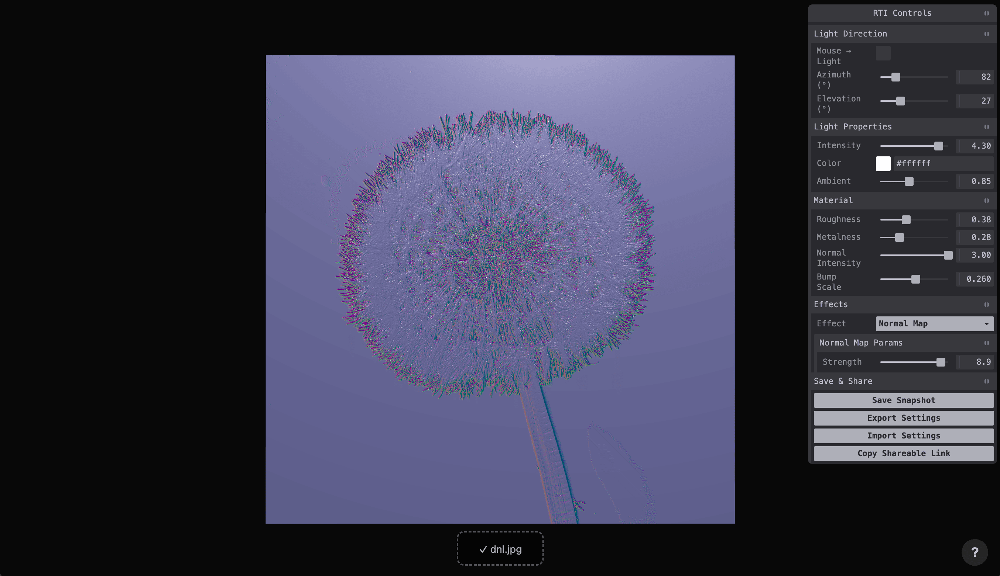

# RTI Web Simulator

A browser-based [Reflectance Transformation Imaging](https://en.wikipedia.org/wiki/Polynomial_texture_mapping) (RTI) simulator built with Three.js. Upload any 2D image and interactively vary the light direction, intensity, and material properties to reveal surface details—just like real raking-light photography.



## Features

- **Interactive lighting** — drag-based azimuth/elevation control
- **Light animation** — automated azimuth sweep with configurable start, end, steps, and duration
- **Material tuning** — roughness, metalness, and normal-map intensity sliders
- **Auto normal-map generation** — Sobel-based normal map derived from the uploaded image
- **GPU-accelerated effects** (via Three.js Shading Language / TSL):
  - Normal Map Visualisation
  - Sobel Edge Detection
  - Emboss
  - Grayscale
  - Chromatic Aberration
  - Halftone
- **Save & share** — PNG snapshot export (cropped to the image plane), JSON settings import/export, shareable URL with encoded parameters
- **Keyboard shortcuts** — `R` reset light · `S` save snapshot · `E` cycle effects · `H` help overlay

## Tech Stack

| Layer    | Technology                                   |
| -------- | -------------------------------------------- |
| Renderer | Three.js `WebGPURenderer` (WebGL 2 fallback) |
| Effects  | Three.js Shading Language (TSL) node graphs  |
| UI       | Tweakpane 4                                  |
| Build    | Vite 8 · TypeScript 5.9 · pnpm               |

## Getting Started

### Prerequisites

- [Node.js](https://nodejs.org/) ≥ 18
- [pnpm](https://pnpm.io/) ≥ 9 (or use `corepack enable`)

### Install & Run

```bash
# Clone the repo
git clone https://github.com/alvinashiatey/RTI_Web_Sim.git
cd RTI_Web_Sim

# Install dependencies
pnpm install

# Start the dev server
pnpm run dev
```

Open the URL printed by Vite (usually `http://localhost:5173/`).

### Production Build

```bash
pnpm run build    # outputs to dist/
pnpm run preview  # serve the build locally
```

## Usage

1. **Upload an image** — drag-and-drop onto the canvas or click the upload zone.
2. **Move the light** — use the Tweakpane sliders (Azimuth / Elevation).
3. **Adjust material** — tweak roughness, metalness, and normal-map strength in the Material folder.
4. **Apply effects** — open the Effects folder and pick an effect from the dropdown, then tune its parameters. Press `E` to cycle.
5. **Animate the light** — open the Animation folder, set start/end azimuth, number of steps, and duration, then click Play.
6. **Save your work** — press `S` for a PNG snapshot, or use Export/Import Settings for the full parameter set.
7. **Share** — copy the URL; it encodes all current parameters (except the uploaded image).

## Keyboard Shortcuts

| Key       | Action                          |
| --------- | ------------------------------- |
| `R`       | Reset light to default position |
| `S`       | Save PNG snapshot               |
| `E`       | Cycle through effects           |
| `H` / `?` | Toggle help overlay             |

## Project Structure

```
src/
  main.ts          # Entry point & keyboard shortcuts
  scene.ts         # WebGPURenderer, camera, scene setup
  lighting.ts      # Point light, ambient light, hemisphere helpers
  material.ts      # MeshStandardNodeMaterial, texture loading, normal-map generation
  controls.ts      # Tweakpane bindings, save/share, snapshot export
  effects.ts       # TSL effect registry & node graphs
  utils.ts         # Image upload handler
  style.css        # Full-viewport layout, overlays, drop zone
public/
  sample.jpg       # Default sample texture
```

## Deployment

The project includes a GitHub Actions workflow that automatically builds and deploys to GitHub Pages on every push to `main`.

**Live demo:** <https://alvinashiatey.github.io/RTI_Web_Sim/>

## License

MIT
